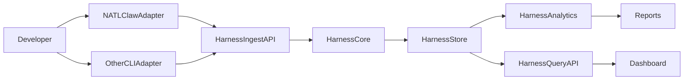
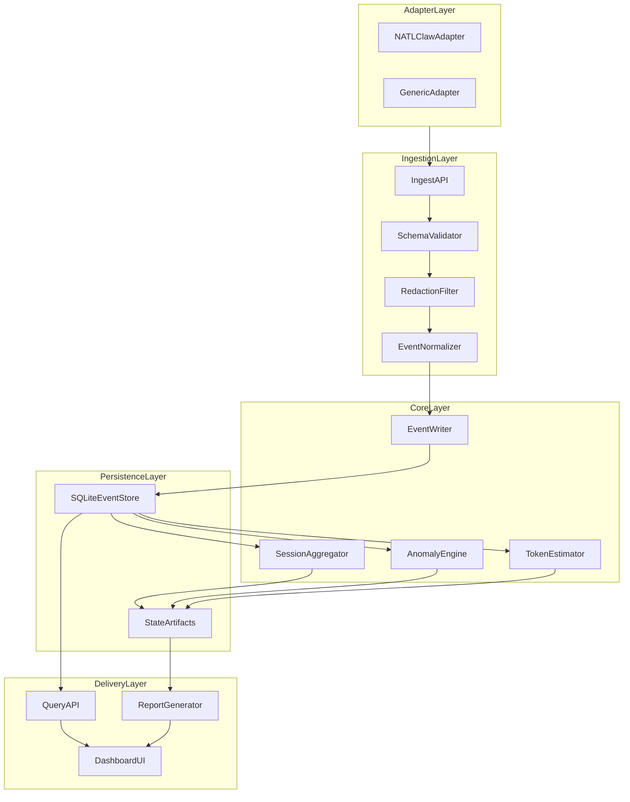
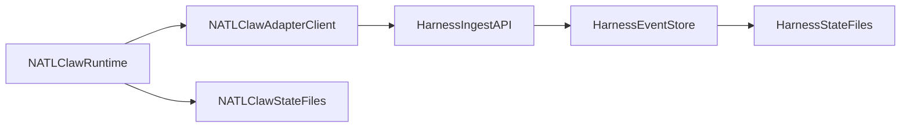
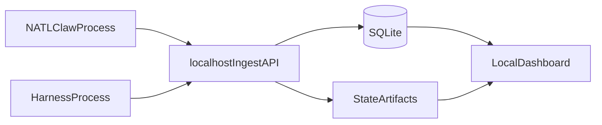

# AgentOps Middleware (Agnostic) — Architecture

## 1. Purpose

Define the architecture of a provider-agnostic coding harness that can integrate with NATLClaw as a base agent runtime while remaining decoupled from NATLClaw internals.

This document is the system blueprint. Requirements live in `requirements.md`; protocol/schema and implementation details live in `spec.md`.

---

## 2. Design Principles

1. **Adapter-first**
   - Every coding CLI/agent integrates via adapter contracts.
   - Provider-specific behavior stays in adapters.

2. **Protocol-first**
   - A versioned event contract (`event-v1`) is the integration boundary.
   - Core services consume normalized events, not provider APIs.

3. **Isolation-first**
   - Harness runs as a standalone subproject and data domain.
   - NATLClaw remains fully functional when harness is absent.

4. **Fail-open integration**
   - Adapter emission must be non-blocking and resilient.
   - Harness outages never block the base coding agent.

5. **Local-first operation**
   - No cloud dependency required for core functionality.
   - Local API + local persistence + local reports by default.

---

## 3. System Context

Interpretation:
- Adapters emit standardized events.
- Harness core validates and persists events.
- Analytics derive insights and reports.
- Query/API and dashboard expose observability.

---

## 4. Logical Architecture

---

## 5. Data Domains

## 5.1 Event Domain (Canonical)

- Immutable event records from adapters.
- Source of truth for replay, aggregation, and auditability.
- Versioned by protocol (`spec_version`).

## 5.2 Session Domain

- Derived from ordered events.
- Tracks lifecycle, activity counts, and usage summaries.

## 5.3 Analytics Domain

- Derived insights and anomaly flags:
  - repeated reads
  - oversized reads
  - high write churn
  - estimated vs measured token deltas

## 5.4 Artifact Domain

- Human-facing files for operational context:
  - memory timeline
  - anatomy index
  - token ledger
  - generated markdown reports

---

## 6. NATLClaw Integration Architecture

Rules:
- NATLClaw writes to its own state files only.
- Harness writes to harness-owned state/store only.
- Integration is event emission over API boundary, not shared in-process state.

---

## 7. Runtime Boundaries and Dependency Direction

Allowed:
- `NATLClaw -> adapter client -> Harness API`

Disallowed:
- `Harness core -> NATLClaw internals`
- Shared mutable DB/schema between NATLClaw and harness
- Embedding harness business logic in `scheduler.py`/`workflow.py`/`second_brain.py`

Boundary policy:
- If harness endpoint is unavailable, adapter drops to buffered/no-op mode based on config.
- No critical NATLClaw execution path may require successful harness round-trips.

---

## 8. Deployment Topology (Local MVP)

Notes:
- Single-machine deployment is default.
- Horizontal scaling is out of scope for MVP but can be added by replacing local store/API layers.

---

## 9. Architectural Decisions (Current)

1. **Protocol versioning from day one**
   - Avoids lockstep releases across adapters.

2. **SQLite + artifact files hybrid**
   - SQLite for queryable events/metrics.
   - Markdown/JSON artifacts for human-readable operational memory.

3. **Polyglot-ready contracts**
   - API/protocol are language-neutral.
   - Initial implementation can be Python; adapters can be Python/Node.

4. **Non-invasive NATLClaw adoption**
   - NATLClaw is first adapter/runtime target, not harness core.

---

## 10. Risks and Architectural Mitigations

- **Risk: Adapter inconsistency**
  - Mitigation: strict required envelope + adapter capability declaration + conformance tests.

- **Risk: Hidden coupling to NATLClaw**
  - Mitigation: enforce one-way dependency and API-only integration.

- **Risk: Ingest bottlenecks**
  - Mitigation: batch endpoint, bounded queue, asynchronous writer.

- **Risk: Misleading token estimates**
  - Mitigation: measured/estimated split with confidence labeling.

---

## 11. Evolution Path

### Stage 1 (MVP Architecture)
- Protocol + ingest + event/session store + basic analyzers + reports.

### Stage 2 (Operational Maturity)
- Stronger dashboard, retention management, adapter certification suite.

### Stage 3 (Ecosystem)
- Multiple production adapters, richer policy engine, optional distributed deployment.

---

## 12. Cross-References

- Requirements: `docs/agentops/requirements.md`
- Technical spec: `docs/agentops/spec.md`

---

## 13. Architectural Guardrails (PoC Governance)

These guardrails keep the middleware generic while preserving persona-defined behavior in NATLClaw.

### Guardrail 1: Core runtime is persona-agnostic

- Core runtime modules execute generic orchestration and persistence only.
- Persona-specific instructions, step prompts, and tool composition must stay in persona definitions (`mcp.json` or external `persona.json`).

Allowed:
- Core consumes `persona` field as metadata for routing/reporting.

Disallowed:
- Core branches by persona name to execute domain-specific tasks.

### Guardrail 2: Adapter-specific logic stays at the edge

- Provider payload translation, retries, and capability differences are adapter responsibilities.
- Core ingest/store/analytics modules do not contain provider-specific branches.

Allowed:
- Adapter emits normalized `event-v1` from provider signals.

Disallowed:
- `analytics/` adds provider-specific token parsing branches.

### Guardrail 3: Routing outputs generic intents

- Routing and processing produce generic intent classes, not domain task templates.
- Persona policy/defaults determine domain-specific execution details.

Allowed:
- Emit `create_task` with normalized payload and persona metadata.

Disallowed:
- Emit provider/persona-specific task body generation in routing core.

### Guardrail 4: One-way dependency direction

- Allowed dependency direction: `NATLClaw -> adapter client -> AgentOps API`.
- Disallowed: `AgentOps core -> NATLClaw internals` or shared mutable state schemas.

Allowed:
- NATLClaw emits events via a thin HTTP client.

Disallowed:
- AgentOps importing `scheduler.py` or mutating NATLClaw state files.

### Guardrail 5: Fail-open integration behavior

- AgentOps outages must not block NATLClaw heartbeats or task progression.
- Integration failures degrade to no-op/buffered/audit-only behavior.

Allowed:
- Drop or buffer event emission when AgentOps is unavailable.

Disallowed:
- Block heartbeat completion on AgentOps write success.

### Guardrail 6: Config-first extensibility

- Adding a persona should not require core runtime edits.
- Adding an adapter should not require breaking schema changes or core business-logic changes.

Allowed:
- New adapter plus conformance tests against `event-v1`.

Disallowed:
- New adapter requiring direct edits to `scheduler.py` or `workflow.py`.

### Guardrail 7: Boundary tests gate release

- Boundary checks must fail CI when core includes provider-specific branches, forbidden imports, or direct adapter writes into core-owned stores.
- PoC release is blocked until boundary checks pass.
