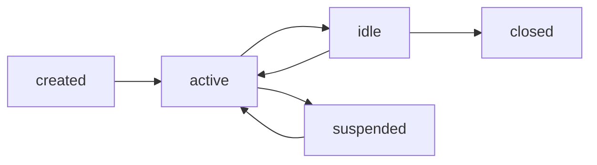

# OpenClaw Session and Routing Design

## Objective

Define deterministic session isolation and routing behavior for channel-origin messages while reusing NATLClaw personas, tasks, and inbox semantics.

## Session Model

Session key format:

- `sess_<channel_type>_<conversation_identity>`

Session fields:

- `session_id`
- `channel_type`
- `origin_type` (`dm`, `group`, `api`, `webhook`)
- `active_persona`
- `state` (`active`, `idle`, `suspended`)
- `reply_mode` (`auto`, `manual_review`, `muted`)
- `last_event_ts`

Lifecycle transitions:

## Routing Decision Contract

Routing input:

- normalized envelope
- session state
- persona defaults
- simple policy hints (`priority`, `requires_reply`)

Routing output:

- `decision`: `create_task | append_inbox_message | ignore | escalate_operator`
- `persona`
- `priority`
- `reason`
- `target` payload

## Persona Mapping Policy

Priority order:

1. Explicit `routing.persona_hint` in event
2. Session-pinned persona (`active_persona`)
3. Default runtime persona

Safety rule:

- If hinted persona is invalid/unavailable, fall back to default persona and emit warning log.

## Routing Rules (MVP)

Rule set:

1. High urgency + actionable request -> `create_task`
2. Non-action informational message -> `append_inbox_message`
3. Unsupported/empty payload -> `ignore`
4. Policy violation or repeated failures -> `escalate_operator`

## Storage and Ownership

- Session store is owned by surface layer.
- Task/outbox updates remain owned by existing modules.
- Surface layer never writes directly to brain/state internals.

## API Visibility

- `GET /api/surface/sessions`
- `GET /api/surface/sessions/{session_id}`
- `GET /api/surface/routes/recent`

Required fields in route logs:

- `session_id`, `event_id`, `decision`, `persona`, `reason`, `timestamp`

## Determinism and Test Matrix

Required tests:

1. Same input envelope + session state yields same decision.
2. Invalid persona hints always fall back to default.
3. Group and DM identities do not collide in `session_id`.
4. Suspended session suppresses task creation unless override flag is set.

## Cross-References

- [OpenClaw Surface Architecture](./openclaw-surface-architecture.md)
- [OpenClaw Surface MVP Design](./openclaw-surface-mvp-design.md)
- [OpenClaw Surface Rollout](./openclaw-surface-rollout.md)

