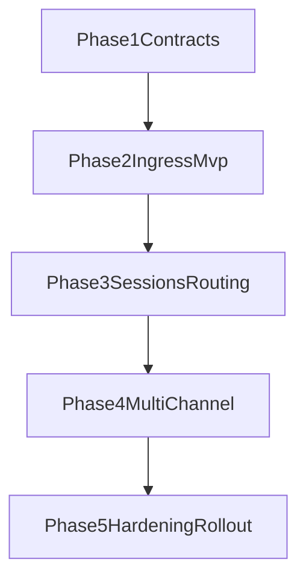

# OpenClaw Surface Adoption Plan

## Goal

Adopt OpenClaw-style interaction surfaces into NATLClaw to improve operational readiness while preserving autonomous learning and second-brain quality.

## Principles

1. Core loops stay intact (`scheduler.py`, `workflow.py`, `second_brain.py`).
2. One scheduler of record; no parallel runtime authority.
3. Channel integrations are adapter-first and optional.
4. Event normalization is strict; adapter details stay adapter-local.
5. Every surface addition is reversible via feature flags.

## Scope

### In Scope

- Event envelope + session + routing contracts
- Single ingress MVP path
- Session/routing operator visibility
- Multi-channel expansion behind normalized contracts
- Hardening tests and rollout controls

### Out of Scope

- Replacing second-brain memory model
- Replacing workflow mode semantics
- Full OpenClaw parity (voice, device nodes, canvas)

## Phase Plan

### Phase 1: Contract and Boundary Foundations

Deliverables:

- Formal contracts in [OpenClaw Surface Architecture](./openclaw-surface-architecture.md)
- Contract examples and invariants
- Boundary and ownership matrix

Exit criteria:

- Teams can build adapters without touching core runtime modules.
- Contract conformance can be validated with fixtures.

### Phase 2: Ingress Surface MVP (Single Channel)

Deliverables:

- One ingress endpoint/adapter path producing normalized events
- Route-to-task and route-to-inbox bridge to existing modules
- Fail-open behavior and ingress health telemetry

Exit criteria:

- At least one inbound message can create actionable work in current task/inbox pipeline.
- Scheduler remains healthy when ingress path fails.

### Phase 3: Session + Routing Surface

Deliverables:

- Session model with `session_id`, channel origin, state, persona mapping
- Routing decisions with deterministic outcomes
- Read APIs for sessions and recent routing decisions

Exit criteria:

- Session metadata visible in API and logs.
- Persona routing behavior is deterministic and test-covered.

### Phase 4: Multi-channel Expansion

Deliverables:

- Additional channel adapters behind same event contract
- Adapter conformance tests and replay fixtures
- Basic per-channel health/error telemetry

Exit criteria:

- Multiple channel types can be enabled independently.
- No channel-specific branching inside scheduler/workflow core.

### Phase 5: Hardening and Rollout

Deliverables:

- Soak/restart/backpressure tests
- Feature-flag rollout sequence
- Operational rollback instructions

Exit criteria:

- Regression gate includes ingress + scheduler coexistence checks.
- Incident response documented in runbook and exercised.

## Milestones and Suggested Cadence

| Milestone                         | Target  |
| --------------------------------- | ------- |
| M1: Contracts accepted            | Week 1  |
| M2: Single channel MVP            | Week 2  |
| M3: Session/routing observability | Week 3  |
| M4: Multi-channel beta            | Week 4+ |
| M5: Production hardening          | Week 5+ |

## Dependency Graph

## Risks and Mitigations

- Contract drift across adapters: enforce conformance fixtures early.
- Coupling into core loops: reject direct adapter writes into state/brain/task stores.
- Queue pressure in burst traffic: bounded queues plus backpressure telemetry.
- Hidden regressions: add focused integration tests before enabling new channels.

## Acceptance Criteria

1. Existing autonomous heartbeats and second-brain evolution are unchanged when new flags are disabled.
2. Single-channel ingress can generate actionable task/inbox work.
3. Session and routing metadata are queryable via API and inspectable via logs.
4. Ingress failures never block scheduler progress or state persistence.
5. Runbook + rollout docs are sufficient for day-2 operations.

## Definition of Done (PoC)

PoC completion requires all gate sections below to be green.

### Gate A: Boundary Integrity

1. Core loops remain free of adapter/provider/persona-specific task hardcoding.
2. Architecture boundary tests enforce no forbidden imports/writes across surface/core domains.
3. Persona behavior differences are represented in persona config/definitions, not in core conditional branches.

### Gate B: Functional Outcomes

1. One ingress path normalizes events and produces actionable task/inbox outcomes.
2. Session and routing metadata are queryable in API and visible in logs.
3. Routing behavior is deterministic for same input envelope + session state.
4. Existing runtime behavior remains unchanged when surface flags are disabled.

### Gate C: Reliability and Operations

1. Malformed event payloads are rejected non-fatally and classified in logs.
2. Restart/crash scenarios preserve state consistency and scheduler progress.
3. Burst traffic behavior follows bounded queue/backpressure policy.
4. Runbook covers enable, disable, rollback, and incident response flow.

### Gate D: Extensibility

1. Additional channel adapters can be onboarded behind the same normalized contract.
2. New persona onboarding requires persona config/content changes without core-loop edits.

## Required Evidence Artifacts (DoD Gate Mapping)

Attach the following evidence before claiming PoC done:

### For Gate A (Boundary Integrity)

- Boundary test output showing no forbidden imports/writes.
- PR diff review notes confirming no persona/provider hardcoding in `scheduler.py`, `workflow.py`, or `second_brain.py`.
- Persona config examples demonstrating behavior differences via config, not core code.

### For Gate B (Functional Outcomes)

- API verification for sessions/routes/events (sample requests + responses).
- At least one end-to-end ingress trace: inbound event -> route decision -> task/inbox outcome.
- Determinism test result showing same input/session state yields same routing decision.

### For Gate C (Reliability and Operations)

- Malformed payload test logs and expected rejection classification.
- Restart/crash consistency test output with state integrity assertions.
- Burst/backpressure test output with queue/drop telemetry.
- Operator runbook walkthrough notes for enable/disable/rollback flow.

### For Gate D (Extensibility)

- Adapter onboarding record (time-to-first-ingest and conformance check results).
- Persona onboarding record showing no core-loop edits required.

## Cross-References

- [OpenClaw Surface Architecture](./openclaw-surface-architecture.md)
- [OpenClaw Surface Rollout](./openclaw-surface-rollout.md)
- [OpenClaw Surface MVP Design](./openclaw-surface-mvp-design.md)
- [OpenClaw Session and Routing Design](./openclaw-session-routing-design.md)
- [Operator Runbook](./operator-runbook.md)
- [2-Week Sprint Board](./sprint-board-2-week.md)

