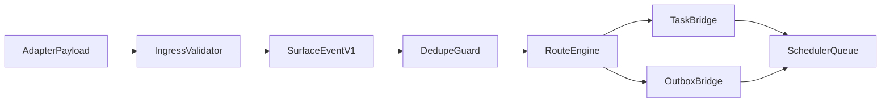

# OpenClaw Surface Architecture for NATLClaw

## 1. Purpose

Define a normalized ingress surface (events, sessions, routing) inspired by OpenClaw while keeping NATLClaw's autonomous knowledge core unchanged.

This architecture adds communication and orchestration surfaces around NATLClaw. It does not replace core learning behavior.

## 2. Non-Goals

- Replace heartbeat scheduling in `scheduler.py`
- Replace workflow execution logic in `workflow.py`
- Replace memory model in `second_brain.py`
- Introduce a second scheduler or competing state authority
- Allow channel adapters to write directly to core state files

## 3. System Boundaries


| Domain                             | Source of truth     | May read from                                             | May write to                                  |
| ---------------------------------- | ------------------- | --------------------------------------------------------- | --------------------------------------------- |
| Heartbeat lifecycle                | `scheduler.py`      | `tasks.py`, `messaging.py`, `state.py`, `second_brain.py` | Same modules only                             |
| Workflow + persona behavior        | `workflow.py`       | `persona_loader.py`, `prompts.py`                         | `second_brain.py`, `tasks.py`, `messaging.py` |
| Knowledge graph                    | `second_brain.py`   | `state.py`, `workflow.py`                                 | Brain store only                              |
| External ingress normalization     | New surface modules | Adapter payloads                                          | Event envelope queue only                     |
| Channel-specific protocol handling | Adapter modules     | Channel API payloads                                      | Ingress API only                              |


Boundary policy:

1. New channel surfaces may only enqueue normalized ingress events.
2. Scheduler remains the single authority that turns ingress events into work.
3. Ingress failures must fail-open and never block heartbeat progression.

## 4. Normalized Event Contract (`surface-event-v1`)

### 4.1 Envelope

```json
{
  "spec_version": "1.0",
  "event_id": "evt_01J...",
  "event_type": "message.received",
  "ts": "2026-04-14T20:25:01Z",
  "source": {
    "adapter": "telegram",
    "channel_type": "telegram",
    "channel_instance": "primary-bot"
  },
  "session": {
    "session_id": "sess_telegram_12345",
    "thread_id": "12345",
    "user_id": "u_abc",
    "group_id": null
  },
  "routing": {
    "persona_hint": "project_manager",
    "priority": "normal",
    "requires_reply": true
  },
  "payload": {
    "text": "Can you summarize today?",
    "attachments": []
  },
  "meta": {
    "trace_id": "trc_01J...",
    "idempotency_key": "telegram:12345:88931"
  }
}
```

### 4.2 Required Fields

- `spec_version`, `event_id`, `event_type`, `ts`
- `source.adapter`, `source.channel_type`
- `session.session_id`
- `payload` (may be empty object)

### 4.3 Supported Event Types (MVP)

- `message.received`
- `message.edited`
- `message.deleted`
- `channel.health.warning`
- `session.opened`
- `session.closed`
- `custom.*` (stored and ignored by default handlers)

### 4.4 Idempotency and Replay Safety

- `meta.idempotency_key` required for adapter-originated user messages
- Duplicate envelope handling must be no-op (same key, same payload hash)
- Replayed envelopes must not create duplicate tasks/messages

Machine-readable schema:

- `[surface-event-v1.schema.json](./surface-event-v1.schema.json)`

## 5. Session Contract

`surface-session-v1` fields:

- `session_id`: stable key derived from channel + conversation identity
- `channel_type`: telegram/discord/webhook/etc.
- `origin_type`: `dm | group | api | webhook`
- `active_persona`: persona selected by router
- `state`: `active | idle | suspended`
- `last_event_ts`: last ingress event timestamp
- `reply_mode`: `auto | manual_review | muted`

Rules:

1. Session identity is owned by ingress/routing, not by heartbeat state files.
2. Persona switching by session is advisory to scheduler; scheduler enforces safe defaults.
3. Session inactivity may downgrade to `idle` without affecting global heartbeat runtime.

## 6. Routing Contract

`surface-routing-v1` decision output:

```json
{
  "route_id": "rte_01J...",
  "session_id": "sess_telegram_12345",
  "decision": "create_task",
  "persona": "project_manager",
  "priority": "high",
  "reason": "contains explicit action request and deadline",
  "target": {
    "task_title": "Summarize daily progress for user",
    "emit_inbox_message": true
  }
}
```

MVP routing decisions:

- `create_task`
- `append_inbox_message`
- `ignore`
- `escalate_operator`

## 7. Ingress to Core Mapping




Bridge behavior:

- `create_task` -> `tasks.create_task(...)`, enqueue wake signal
- `append_inbox_message` -> `messaging.append_message(...)`
- `escalate_operator` -> `emit_alert(...)`, optional API status annotation

## 8. Failure and Reliability Model

Fail-open guarantees:

1. Adapter parse failure: reject event, log classification, continue.
2. Route failure: fallback to inbox alert path, continue.
3. Queue saturation: bounded buffering with drop counter + warning alert.
4. Scheduler unavailable: ingress accepts and persists minimal event audit, retries enqueue.

## 9. Feature Flags

- `SURFACE_INGRESS_ENABLED` (default `false`)
- `SURFACE_ROUTING_ENABLED` (default `false`)
- `SURFACE_SESSIONS_ENABLED` (default `false`)
- `SURFACE_CHANNELS_ENABLED` (comma list; empty by default)

All flags default to disabled so existing behavior remains unchanged until explicitly enabled.

## 10. API Surface (Proposed)

- `POST /api/surface/events` (single ingress event)
- `POST /api/surface/events/batch`
- `GET /api/surface/sessions`
- `GET /api/surface/sessions/{session_id}`
- `GET /api/surface/routes/recent`
- `GET /api/surface/health`

API endpoints are read/write wrappers around normalized contracts; they must not invoke workflow execution directly.

## 11. Conformance Tests (Required Before Multi-channel)

1. Envelope schema validation and rejection tests
2. Idempotency tests for duplicate message ingress
3. Queue backpressure behavior under burst load
4. Scheduler lock/restart compatibility with active ingress
5. Session routing consistency across two channel adapters

## 12. Architectural Guardrails

The following guardrails are release blockers for surface work.

### Guardrail 1: Core runtime is persona-agnostic

- Core modules (`scheduler.py`, `workflow.py`, `second_brain.py`) may run workflows and route intents, but must not encode persona domain behavior (for example "React planning" or "DevOps health checks").
- Persona-specific instructions, step prompts, tool lists, and workflow variants belong in persona definitions (`mcp.json` or external `persona.json`).

Allowed:
- `workflow.py` invokes persona-defined steps.

Disallowed:
- `workflow.py` adds `if persona == "react_site_builder": ...`.

### Guardrail 2: Adapter-specific logic stays at the edges

- Channel/provider payload parsing, protocol translation, retries, and auth handling stay in adapter/surface modules.
- Core heartbeat and workflow paths must not branch on adapter/provider identifiers.

Allowed:
- Adapter maps Discord payloads to `surface-event-v1`.

Disallowed:
- Scheduler branch like `if source.adapter == "discord": ...`.

### Guardrail 3: Routing emits intent classes, not domain behavior

- Surface routing outputs generic decisions (`create_task`, `append_inbox_message`, `ignore`, `escalate_operator`).
- Domain-specific execution behavior is resolved by persona policy/defaults after routing.

Allowed:
- Route output contains `decision=create_task` and `persona=project_manager`.

Disallowed:
- Route engine writes React-specific task templates directly.

### Guardrail 4: One-way dependency direction

- Core may depend on persona configuration contracts.
- Adapters may depend on ingress contracts.
- Core must not import adapter internals, and adapters must not write directly to core-owned stores.

Allowed:
- `adapter -> ingress API -> scheduler queue`.

Disallowed:
- Adapter writes directly into `tasks` or `second_brain` persistence files.

### Guardrail 5: Fail-open integration

- Ingress, adapter, or surface outages must not block heartbeat progression.
- Unavailable optional surfaces degrade to no-op, buffered, or audit-only behavior.

Allowed:
- Ingress failure logs warning and continues scheduler loop.

Disallowed:
- Heartbeat blocks on successful ingress round-trip.

### Guardrail 6: Config-first extensibility

- New personas are added with config and persona files, not core-loop edits.
- New adapters are added with adapter modules and conformance fixtures, not workflow/scheduler edits.

Allowed:
- Add `persona.json` plus instructions/tools module.

Disallowed:
- Add hardcoded persona branches in scheduler to support new persona.

### Guardrail 7: Test-enforced boundaries

- CI boundary tests must fail when:
  - core adds provider/channel-specific branches
  - adapter modules directly mutate core-owned state stores
  - persona-specific step logic is hardcoded in core

Release note:
- Surface features are not considered complete unless these checks are green.

## 13. Cross-References

- [OpenClaw Surface Adoption Plan](./openclaw-surface-adoption-plan.md)
- [OpenClaw Surface Rollout](./openclaw-surface-rollout.md)
- [OpenClaw Surface MVP Design](./openclaw-surface-mvp-design.md)
- [OpenClaw Session and Routing Design](./openclaw-session-routing-design.md)
- [NATLClaw vs OpenClaw Comparison](./openclaw-comparison.md)
- [Operator Runbook](./operator-runbook.md)

