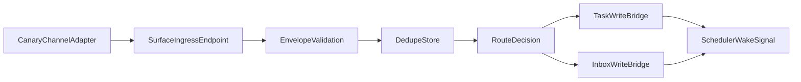

# OpenClaw Surface MVP Design (Single Channel)

## Objective

Design a minimal single-channel ingress path that converts inbound channel events into existing NATLClaw task/inbox pathways without changing core heartbeat behavior.

## Existing Building Blocks

- Scheduler wake and event handling: `scheduler.py`
- Current event watcher queue behavior: `event_watcher.py`
- Task creation/lifecycle: `tasks.py`
- Operator messages/inbox: `messaging.py`
- API server hosting/control patterns: `api_server.py`

## MVP Scope

In scope:

- One inbound channel adapter (canary)
- Event normalization into `surface-event-v1`
- Route decisions for `create_task` and `append_inbox_message`
- Queue wake signal into existing scheduler cycle

Out of scope:

- Multi-channel fan-in
- Advanced multi-agent dispatch
- Rewriting task lifecycle semantics

## Proposed Request Path

## Bridge Mapping to Current Modules

`create_task` path:

1. Build task from routed payload (`title`, `description`, `priority`).
2. Append task through `tasks.py` storage path.
3. Emit scheduler wake event to existing queue semantics.

`append_inbox_message` path:

1. Convert routed payload to operator-facing message.
2. Persist through `messaging.py` outbox model.
3. Optionally emit wake event for immediate processing.

## API Shape (MVP)

Endpoint:

- `POST /api/surface/events`

Response:

- `202` accepted, includes `event_id`, `session_id`, `decision`
- `400` invalid schema/payload
- `409` duplicate idempotency key

## Validation and Safety Rules

1. Reject payloads missing required envelope fields.
2. Reject unknown channel adapters unless explicitly enabled.
3. Treat duplicates as idempotent success/no-op.
4. Never call workflow execution directly from ingress path.
5. On bridge error, create operator alert message and continue runtime.

## MVP Acceptance Tests

1. Inbound message creates one task and one wake signal.
2. Duplicate inbound message does not create additional task.
3. Invalid payload returns `400` and no state mutation.
4. Bridge failure produces inbox alert and heartbeat remains healthy.

## Observability (MVP)

- accepted/rejected counters
- dedupe hit counters
- route decision counters by type
- bridge error counters

## Dependencies

- [OpenClaw Surface Architecture](./openclaw-surface-architecture.md)
- [OpenClaw Surface Contract Examples](./openclaw-surface-contract-examples.md)
- [OpenClaw Surface Boundary Policy](./openclaw-surface-boundary-policy.md)
- [OpenClaw Surface Rollout](./openclaw-surface-rollout.md)

