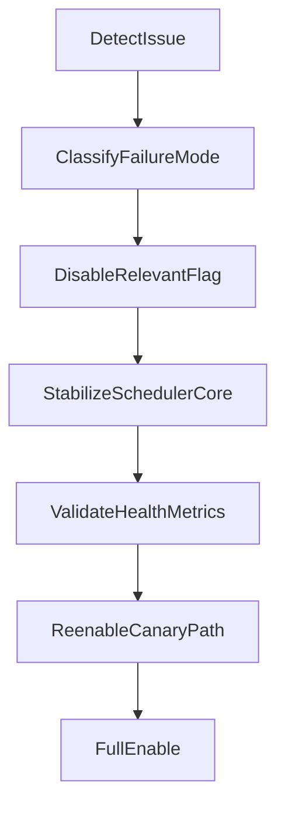

# OpenClaw Surface Rollout and Operations

## 1. Rollout Strategy

Use a staged rollout with hard gates and immediate rollback paths.

Rollout order:

1. Contracts only (no runtime behavior change)
2. Ingress endpoint enabled for one canary channel
3. Session/routing visibility enabled
4. Additional channels enabled one by one
5. Full hardening gate before broader usage

## 2. Feature Flags

| Flag                       | Default | Purpose                              |
| -------------------------- | ------- | ------------------------------------ |
| `SURFACE_INGRESS_ENABLED`  | `false` | Enables normalized ingress endpoints |
| `SURFACE_ROUTING_ENABLED`  | `false` | Enables route decision engine        |
| `SURFACE_SESSIONS_ENABLED` | `false` | Enables session state tracking       |
| `SURFACE_CHANNELS_ENABLED` | empty   | Comma list of allowed adapters       |

Safe defaults:

- All flags off at boot
- Explicit allow-list for channels
- Routing disabled unless ingress health is green

## 3. Promotion Gates

### Gate A: Contract Readiness

- Event schema fixtures passing
- Boundary policy documented
- No core module ownership ambiguity

### Gate B: Canary Ingress

- Single-channel end-to-end task creation works
- Duplicate ingress is idempotent
- Heartbeat p95 not degraded beyond accepted threshold

### Gate C: Session/Routing Visibility

- Session inventory endpoint returns stable IDs
- Routing decision logs include reason + target
- Operators can trace channel event to task outcome

### Gate D: Multi-channel Beta

- Adapter conformance suite passing for each channel
- Backpressure telemetry visible
- Error alerts mapped to actionable runbook steps

### Gate E: Production Hardening

- Soak tests with mixed channel/event bursts
- Crash/restart consistency tests passing
- Rollback drill validated

## 4. Failure Modes and Rollback

### FM-1: Ingress Parse Failures Spike

Symptoms:

- Increased validation errors
- Low accepted event count

Actions:

1. Disable affected channel in `SURFACE_CHANNELS_ENABLED`.
2. Keep `SURFACE_INGRESS_ENABLED=true` for healthy channels.
3. Replay only validated samples after adapter fix.

### FM-2: Queue Backpressure

Symptoms:

- Queue depth rising continuously
- Route latency rising

Actions:

1. Disable `SURFACE_ROUTING_ENABLED` to reduce processing cost.
2. Keep ingest on if buffering is bounded.
3. Drain queue and re-enable routing after depth normalizes.

### FM-3: Scheduler Contention or Lock Recovery Events

Symptoms:

- Scheduler status flapping
- Lock diagnostics report stale/contended behavior

Actions:

1. Disable `SURFACE_INGRESS_ENABLED`.
2. Stabilize scheduler via existing runbook controls.
3. Re-enable ingress only after scheduler health remains stable.

### FM-4: Routing Misclassification

Symptoms:

- Tasks created for noise events
- Missing responses for valid user requests

Actions:

1. Disable `SURFACE_ROUTING_ENABLED`.
2. Preserve raw ingress events for offline analysis.
3. Patch routing rules and validate against fixtures before re-enable.

## 5. Observability Requirements

Minimum metrics:

- `surface_ingress_accepted_total`
- `surface_ingress_rejected_total`
- `surface_queue_depth`
- `surface_route_decision_total{decision}`
- `surface_route_error_total`
- `surface_idempotent_dropped_total`
- `surface_session_active_total`

Minimum logs:

- Envelope validation failure reason
- Route decision with reason and target
- Queue overflow/drop events
- Flag transitions and effective channel allow-list

## 6. Test Plan for Rollout

### Required Automated Tests

1. Schema + contract conformance tests
2. Idempotency duplicate message tests
3. Task/inbox bridge integration tests
4. Scheduler lock/recovery coexistence tests
5. Soak test for burst ingress and bounded queue behavior

### Manual Verification Checklist

- Send canary channel message -> verify task/inbox outcome
- Verify session appears in session API
- Disable routing flag -> verify scheduler unaffected
- Re-enable routing -> verify decisions resume correctly

## 7. Operational Playbook Summary

## 8. Cross-References

- [OpenClaw Surface Adoption Plan](./openclaw-surface-adoption-plan.md)
- [OpenClaw Surface Architecture](./openclaw-surface-architecture.md)
- [OpenClaw Surface MVP Design](./openclaw-surface-mvp-design.md)
- [OpenClaw Session and Routing Design](./openclaw-session-routing-design.md)
- [Operator Runbook](./operator-runbook.md)

